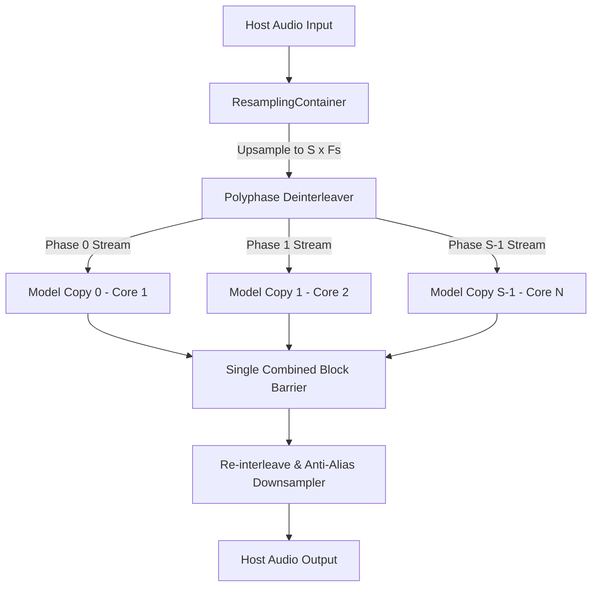

# NAM On Steroids

NAM On Steroids is a fork of the Neural Amp Modeler plugin focused on adding experimental oversampling support for NAM models and improving/expanding its features.

## Oversampling approach

This fork does not use only conventional plugin-level oversampling. Instead, it combines host-rate resampling with time-scaled processing inside NAM models where possible.

When oversampling is enabled, the plugin runs the NAM model at a higher internal sample rate. For architectures that use temporal convolutions, the convolution timing is scaled so that the model keeps approximately the same time behavior while running at the oversampled rate.

The goal is to reduce aliasing generated by nonlinear model processing while preserving the original model response as closely as possible.

This approach was suggested/inspired by these papers:

https://arxiv.org/abs/2505.11375

https://arxiv.org/abs/2406.06293

https://arxiv.org/abs/2501.18470

https://arxiv.org/abs/2505.04082

### How to use oversampling

Click on the logo in the upper-left corner, the Oversampling menu will appear and provide these options, for both realtime usage and offliine rendering:

- OFF
- 2x
- 4x
- 8x
- 16x
- 32x

It also includes selectable anti-alias filter phase modes, separate for realtime and offline rendering:

- Minimum Phase (0 latency)
- Linear Phase short (1.6 ms latency at 48 kHz)
- Linear Phase Long (10 ms latency at 48 kHz)

### Multi-core

When using oversampling, the load on the CPU can be split to all available cores so you can use high oversampling rates without impacting the performance of your machine.

## Additional features

### Stereo processing

This fork adds a little button (below the output level control) to choose between mono and stereo processing. For the moment it just uses the same NAM model and IR for both channels, but in the future I'll add the possibility to load two different models and IRs or link them to replicate the current behaviour.

### Customizable tonestacks

The behaviour of the EQ controls can be changed by selecting a different tonestack, the available types are based on schematics of popular amps, pedals and outboard gear.
They can also be tweaked by changing component values in the Tonestack page (click on the Tonestack label to access it).

### Pre/post EQ

This fork adds a switch to move the EQ pre or post NAM, so you can sculpt the tone before or after distortion

### Filters

Low cut and high cut filters with independent slope control and pre/post switch. The filters page can be accessed by clicking on the red icon in the bottom-right corner.

### Boost

12 dB of additional input gain which can be added by engaging the Boost switch.

### Noise gate position

The noise gate trigger, unlike NeuralAmpModelerPlugin, works before the input gain control is applied. The input gain is applied after the gate trigger stage and before the NAM model.

This keeps the gate behavior less affected by input gain changes while preserving the post-NAM gate gain stage.

### Presets

128 internal presets that can be freely named and recall all parameters except those in the Oversampling and Settings pages.

### MIDI support

Presets can be recalled via Program Change messages (PC #000 recalls preset #001), Control Change messages can be assigned to most parameters either manually or via the learn function (right-click on the parameter to assign/learn the CC).

### Auto IR bypass and Output mode

Automatic bypass/engage logic for the IR based on gear type:
It is automatically bypassed when selecting a .nam file with gear_type metadata being amp_cab, amp_pedal_cab, pedal, preamp or studio.
It's automatically engaged when gear_type is amp or pedal_amp.

Additional 'Auto' option in the Output mode, this automatically sets the output mode to Calibrated when gear_type is pedal or preamp, and sets it to Normalized for all other possible types.

### Theme color

You can customize the color of all lit-up elements via the theme color selector in the Settings page.
You can also make the color automatically be the same as the color of the track on your DAW by enabling "Follow Track Color"

### Tuner

No amount of oversampling will make you sound better if you're out of tune, use it!

---

# Technical Deep Dive: Neural Amp Modeler Oversampling

## Overview & The Aliasing Problem

Neural Amp Modeler (NAM) uses deep neural network architectures—such as WaveNet dilated 1D convolutions and LSTM networks—to emulate physical tube amplifiers, preamps, and distortion pedals.

Non-linear operations inside these networks (such as saturation, hard clipping, and non-linear activation functions like ReLU, Tanh, or Snake) generate infinite high-frequency harmonics. If these harmonics extend beyond the Nyquist frequency ($F_s / 2$), they fold back into the audible spectrum as harsh, unharmonic **aliasing distortion**.

Traditional plugin oversampling upsamples the incoming audio, passes it sample-by-sample through the DSP algorithm, and downsamples it. However, applying standard oversampling directly to neural amp models introduces two major challenges:
1. **Time-constant shifting**: Naively changing the sample rate shifts the frequency response and timbre of temporal convolutions.
2. **Computational overhead**: Running deep neural networks sequentially at rates like $192\text{ kHz}$ or $384\text{ kHz}$ creates an unsustainable single-thread CPU load.

This plugin resolves both issues using a **dual-layer architecture**: high-performance DSP resampling paired with **Time-Scaled Dilation Processing** for single-core execution and **Polyphase Decomposition** for multi-core scaling.

---

## Single-Core Oversampling: Time-Scaled Dilation Processing

### The Dilation Shift Problem
In WaveNet and ConvNet architectures, 1D dilated convolutions (`Conv1D`) use a **dilation factor** ($d$) to specify the spacing between tap samples in the temporal receptive field:

$$\Delta t = \frac{d}{F_s}$$

For a model trained at $48\text{ kHz}$ with dilation $d = 1$, the tap spacing corresponds to a physical time delay of $\approx 20.83\,\mu\text{s}$. If the audio is upsampled by $4\times$ ($192\text{ kHz}$) without modifying the model, $d = 1$ would correspond to $\approx 5.2\,\mu\text{s}$. The physical time-constants (EQ curves, saturation decay, filter cutoffs) would shift up by two octaves, completely altering the sound.

### The Solution: Dynamic Time-Scaling (`SetTimeScale`)
When oversampling by a factor $S$ ($S \in \{2, 4, 8, 16, 32\}$) in single-core mode, the plugin calls `SetTimeScale(S)` on the model.

Inside every `Conv1D` layer, the dilation scale is dynamically updated:

```cpp
void Conv1D::SetTimeScale(const int scale)
{
  this->_dilation_scale = std::max(1, scale);
  this->_dilation = this->_base_dilation * this->_dilation_scale;
  if (_max_buffer_size > 0)
    SetMaxBufferSize(_max_buffer_size);
}
```

### Mathematical Time-Invariance
Because the rendering sample rate increases by $S$ ($F_{\text{rendering}} = S \cdot F_s$) and the sample spacing increases by $S$ ($\text{dilation} = d_{\text{base}} \cdot S$), the physical time duration between convolution taps remains **100% invariant**:

$$\Delta t = \frac{d_{\text{base}} \cdot S}{S \cdot F_s} = \frac{d_{\text{base}}}{F_s}$$

### How Aliasing is Eliminated
1. **High Nyquist Ceiling**: At $16\times$ oversampling ($768\text{ kHz}$ rate), the Nyquist frequency is pushed to $384\text{ kHz}$.
2. **Harmonic Isolation**: Non-linear saturation harmonics fall into the ultrasonic region ($24\text{ kHz} \dots 384\text{ kHz}$) instead of folding back into the $0 \dots 20\text{ kHz}$ audio band.
3. **Exact Tone Preservation**: Thanks to dilation scaling, the frequency response, dynamic feel, and harmonic texture match the original native model.

### Single-Core Processing Pipeline

```
[Host Audio Input]
       │
       ▼
┌──────────────────────────────────────────────────────────────┐
│ 1. Upsampling (dsp::ResamplingContainer)                     │
│    - Inserts zero samples & applies anti-aliasing lowpass    │
│    - Minimum Phase (0 latency) or Linear Phase (FIR)         │
└──────────────────────────────┬───────────────────────────────┘
                               │ Buffer size: S × N frames @ S × Fs
                               ▼
┌──────────────────────────────────────────────────────────────┐
│ 2. Time-Scaled Model Execution (mEncapsulated->process)      │
│    - Dilation = Base_Dilation × S                            │
│    - Internal Ring Buffer sized for S × Receptive Field      │
│    - Non-linear saturation runs at elevated sample rate      │
└──────────────────────────────┬───────────────────────────────┘
                               │ High-rate audio buffer with distortion
                               ▼
┌──────────────────────────────────────────────────────────────┐
│ 3. Decimation / Downsampling                                 │
│    - Anti-aliasing lowpass filters out harmonics > 24 kHz    │
│    - Decimates audio back to host rate Fs                    │
└──────────────────────────────┬───────────────────────────────┘
                               │
                               ▼
                      [Host Audio Output]
```

## Multi-Core Oversampling: Polyphase Decomposition

For high oversampling factors ($8\times, 16\times, 32\times$) or heavy models, running a single thread at $384\text{ kHz}+$ can overload one CPU core. Multi-core oversampling addresses this through **Polyphase Decomposition**:



### Mechanism
1. An oversampled input stream $x[n]$ at rate $S \cdot F_s$ is split into $S$ interleaved sub-streams (phases):
   $$x_p[m] = x[S \cdot m + p], \quad p \in \{0, 1, \dots, S-1\}$$
2. Each phase stream $x_p[m]$ is processed at the **native sample rate** ($F_s$) by a separate instance of the model.
3. The plugin dispatches these $S$ phase lanes across multiple CPU worker threads via `NAMPhaseMulticorePool`.
4. A single synchronization barrier recombines the processed outputs at the end of each audio block, preventing thread contention.

---

## Single-Core vs. Multi-Core Comparison

| Feature | Single-Core Oversampling | Multi-Core Oversampling |
| :--- | :--- | :--- |
| **Model Instances** | 1 single model instance | $S$ independent model copies |
| **Execution Rate** | Sequentially at $S \cdot F_s$ | $S$ parallel lanes at native $F_s$ |
| **Dilation Mode** | Scaled dilations ($d_{\text{base}} \cdot S$) | Native dilations ($d_{\text{base}} \cdot 1$) |
| **CPU Distribution** | Single thread | Distributed across all CPU cores |
| **Best Used For** | $2\times / 4\times$ oversampling or light models | $8\times / 16\times / 32\times$ oversampling or heavy WaveNet models |

---

## DSP Resampling Engine (`dsp::ResamplingContainer`)

Sample rate conversion between the host DAW rate and the internal rendering rate is managed by `dsp::ResamplingContainer`.

### Cascaded Half-Band Resamplers
For all power-of-two ratios ($2\times, 4\times, 8\times, 16\times, 32\times$), the engine uses cascades of $2\times$ **Half-Band filters**:
- In half-band FIR filters, every second coefficient (except the center tap) is zero, reducing arithmetic operations by 50%.
- Non-power-of-two or fractional ratios automatically fall back to a Lanczos polyphase sinc resampler.

### Anti-Aliasing Filter Phase Modes

| Filter Mode | Latency | DSP Implementation | Primary Use Case |
| :--- | :--- | :--- | :--- |
| **Minimum Phase** | **0 samples** | 2-path IIR allpass polyphase filters + pre-guard lowpass | Real-time playing & ultra-low latency monitoring |
| **Linear Phase (Short)** | ~1.6 ms @ 48 kHz | Half-band FIR (SIMD AVX/NEON accelerated) | Balanced tracking & mixing with zero phase distortion |
| **Linear Phase (Long)** | ~10 ms @ 48 kHz | High-order half-band FIR (SIMD AVX/NEON accelerated) | Mastering & offline rendering with maximum stopband attenuation |

### Model Bandwidth Protection
NAM models are typically trained on 48 kHz audio (Nyquist frequency of 24 kHz).
- When running at higher host sample rates (e.g., 96 kHz / 192 kHz) or using oversampling, high frequencies outside the model's natural bandwidth could cause unexpected artifacts.
- The ResamplingContainer automatically adapts its bandwidth filtering (bandwidthSampleRate) to match the model's native sample rate, guaranteeing that out-of-band signals are filtered cleanly before entering the neural network.
